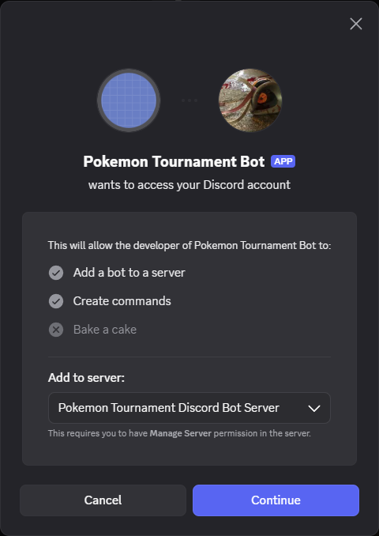
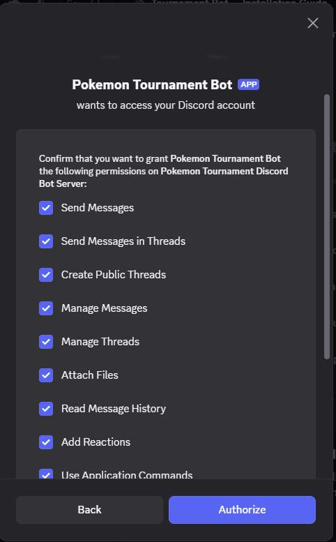
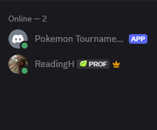
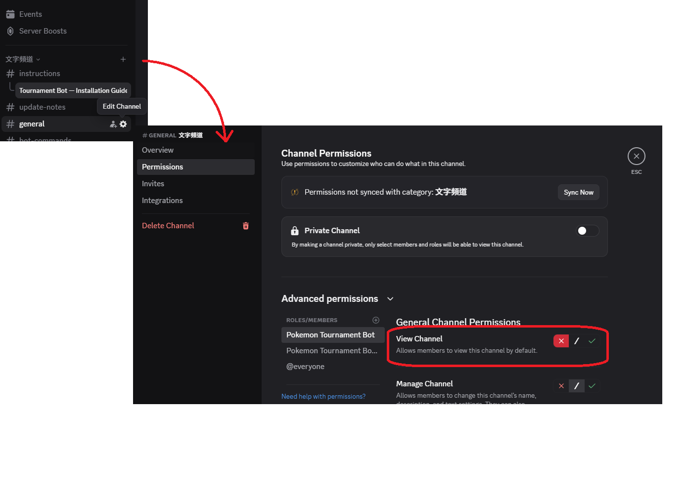
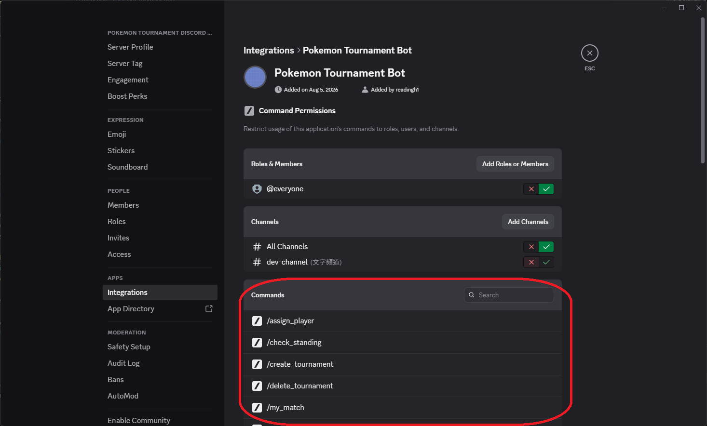

# Tournament Bot — Installation Guide

This guide walks Tournament Organizers (TOs) and server admins through installing the bot and setting it up correctly.

---

## 1. Install the Bot

1. Click the install link below (ask your bot developer for the current one if this has changed):

   [Install Pokemon Tournament Discord Bot](https://discord.com/oauth2/authorize?client_id=1534684661341753384&permissions=328565106752&integration_type=0&scope=bot+applications.commands)
   

2. In the server picker, choose the server you want to install the bot to.

   

3. Review the permissions screen and click **Authorize**.

   

4. Complete the CAPTCHA if prompted. The bot should now appear in your server's member list.

   

---

## 2. What Permissions Does It Need?

The install link above grants the following permissions automatically — you don't need to configure these manually, but it's useful to know what the bot can and can't do:

| Permission | Why it's needed |
|---|---|
| **Send Messages** | Posting tournament updates, embeds, and confirmations. |
| **Send Messages in Threads** | All tournament activity happens inside dedicated threads. |
| **Create Public Threads** | `/create_tournament` spins up a new thread per tournament. |
| **Manage Threads** | Needed to delete a thread when `/delete_tournament` is used. |
| **Embed Links** | Rosters, pairings, and standings are posted as rich embeds. |
| **Attach Files** | Reserved for future report/export features. |
| **Read Message History** | Needed for the bot to reference prior messages in a thread. |
| **Add Reactions** | Reserved for future interactive features. |
| **Use Application Commands** | Required for all `/slash` commands to function. |

> ⚠️ If you ever see the bot fail to post an embed (e.g. roster/standings look broken or missing), double-check that **Embed Links** and **View Channel** are still enabled for the bot's role in the specific channel/category it's confined to — server-level channel overrides can silently strip permissions granted at install time.

---

## 3. Confine the Bot to a Single Channel (Recommended)

Tournament threads are created from a specific parent channel, so it's a good idea to restrict where the bot (and its commands) can post:

1. Go to **Server Settings → Roles**, find the bot's role (it's usually auto-named after the bot).
2. Or, go directly into the channel you want to use → **Edit Channel → Permissions** → add the bot (or its role) → grant it access there, and optionally deny it in other channels.

   

This keeps tournament threads organized in one place and prevents accidental use elsewhere in your server.

---

## 4. Set Up the Tournament Organizer Role (Optional)

By default, only **Server Administrators** — and whoever personally creates a tournament — can manage it. If you want other trusted staff to be able to create and manage tournaments too:

1. Go to **Server Settings → Roles → Create Role**.
2. Name it exactly **`Tournament Organizer`** (this name is hardcoded and must match exactly).
3. Assign this role to the users you want to be able to run tournament-management commands.

---

## 5. Grant Command Visibility to the TO Role (Recommended)

Tournament-management commands (`/create_tournament`, `/upload_roster`, `/upload_pairing`, `/upload_standing`, `/delete_tournament`, `/assign_player`, `/unregister_player`) are hidden from regular members by default — only users with **Manage Server** permission can see them out of the box.

If your Tournament Organizers **aren't** also Server Admins, you'll need to manually grant them visibility:

1. Go to **Server Settings → Integrations**.
2. Find the bot in the list and click into it.
3. Under command permissions, find each tournament-management command and add the **Tournament Organizer** role to its allowed list.

   

---

## 6. You're Ready!

Head into any channel the bot can see and run `/create_tournament` to spin up your first tournament thread. See the **Command Guide** for full usage details and examples.
